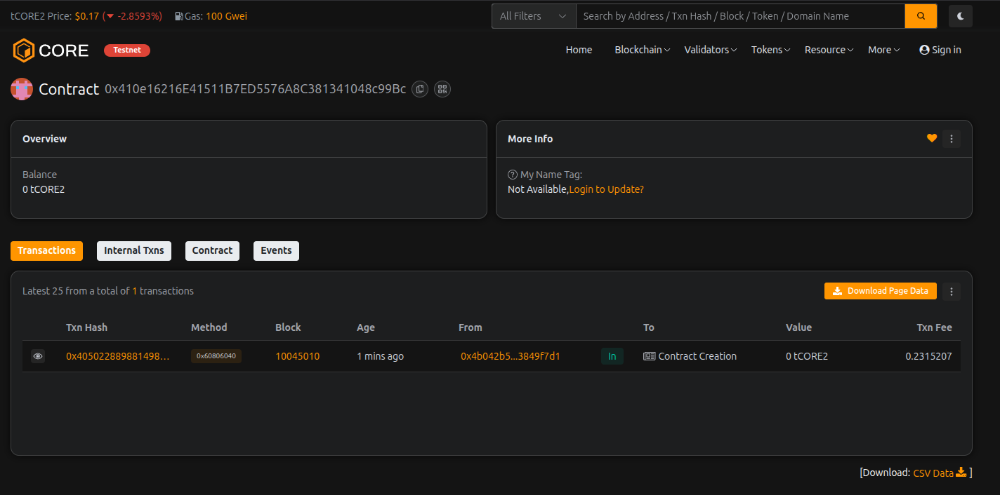

# ProofStake Finance

## Project Description

ProofStake Finance is a decentralized staking platform built on Ethereum that allows users to stake their ETH and earn rewards over time. The platform implements a secure and transparent staking mechanism with customizable parameters, providing users with a reliable way to generate passive income through their cryptocurrency holdings.

The smart contract features a lock period mechanism to ensure stability, configurable reward rates, and a minimum stake requirement. Users can stake their ETH, claim rewards periodically, or unstake their funds after the lock period expires. The platform is designed with security and transparency in mind, ensuring fair reward distribution to all participants.

## Project Vision

Our vision is to create a trustless and decentralized financial ecosystem where users can confidently stake their assets and earn predictable returns without intermediaries. ProofStake Finance aims to democratize access to staking rewards, making it simple and accessible for everyone—from individual investors to institutional participants.

We envision ProofStake Finance becoming a foundational layer in the DeFi ecosystem, where:
- **Transparency** is guaranteed through open-source smart contracts
- **Security** is paramount with audited and battle-tested code
- **Accessibility** ensures anyone can participate regardless of their stake size
- **Sustainability** is achieved through balanced tokenomics and reward mechanisms

## Key Features

- **🔒 Secure Staking**: Stake ETH with a configurable lock period to earn rewards
- **💰 Flexible Rewards**: Claim rewards periodically without unstaking your principal
- **📊 Real-time Statistics**: View your stake details, pending rewards, and contract statistics
- **⚙️ Configurable Parameters**: Owner can adjust reward rates and minimum stake amounts
- **🔐 Lock Period Protection**: Time-locked stakes ensure platform stability
- **📈 Transparent Rewards Calculation**: Clear and auditable reward distribution mechanism
- **💎 Minimum Stake Requirement**: Configurable minimum stake to maintain network quality
- **🏦 Rewards Pool Management**: Owner can deposit funds to ensure sustainable reward distribution
- **📱 User-friendly Interface**: Easy-to-use functions for staking, unstaking, and claiming rewards
- **🔍 Comprehensive Tracking**: Monitor all stakers and contract statistics in real-time

## Future Scope

### Phase 1 (Short-term)
- Add support for ERC20 token staking alongside ETH
- Implement tiered reward rates based on stake amount and duration
- Create a frontend dashboard for easier interaction
- Add emergency withdrawal function with penalty mechanism

### Phase 2 (Mid-term)
- Integrate with major DeFi protocols for yield optimization
- Implement governance token for community-driven decisions
- Add NFT rewards for long-term stakers
- Create a referral program to incentivize platform growth
- Develop mobile application for iOS and Android

### Phase 3 (Long-term)
- Cross-chain staking support (Polygon, BSC, Avalanche)
- Automated reward compounding mechanism
- Insurance pool for additional user protection
- Partnership with institutional investors
- Launch of ProofStake DAO for decentralized governance
- Integration with Layer 2 solutions for reduced gas fees

### Advanced Features
- AI-powered reward optimization
- Social trading features and staking leaderboards
- Integration with crypto lending protocols
- Multi-signature wallet support for institutional users
- Advanced analytics and reporting dashboard

## Deployment Instructions

### Constructor Parameters

The ProofStakeFinance contract requires three parameters during deployment:

1. **_rewardRate** (uint256): Reward rate in basis points (e.g., 100 = 1% daily reward)
   - Example: `100` (1% per day)
   - Range: 1 to 10000

2. **_minStakeAmount** (uint256): Minimum stake amount in Wei
   - Example: `1000000000000000000` (1 ETH in Wei)
   - Or: `100000000000000000` (0.1 ETH in Wei)

3. **_lockPeriod** (uint256): Lock period in seconds
   - Example: `86400` (1 day)
   - Or: `604800` (7 days)
   - Or: `2592000` (30 days)

### Example Deployment Values

**Option 1: Conservative (Recommended for Testing)**
```
_rewardRate: 50
_minStakeAmount: 100000000000000000
_lockPeriod: 86400
```
- 0.5% daily rewards
- 0.1 ETH minimum stake
- 1 day lock period

**Option 2: Moderate**
```
_rewardRate: 100
_minStakeAmount: 1000000000000000000
_lockPeriod: 604800
```
- 1% daily rewards
- 1 ETH minimum stake
- 7 days lock period

**Option 3: Aggressive**
```
_rewardRate: 200
_minStakeAmount: 5000000000000000000
_lockPeriod: 2592000
```
- 2% daily rewards
- 5 ETH minimum stake
- 30 days lock period

### Quick Wei Conversion Reference
- 0.01 ETH = `10000000000000000`
- 0.1 ETH = `100000000000000000`
- 1 ETH = `1000000000000000000`
- 5 ETH = `5000000000000000000`
- 10 ETH = `10000000000000000000`

## Contract Details:

**Deployment Parameters Used:**
- Reward Rate: _____ (basis points)
- Minimum Stake: _____ (Wei)
- Lock Period: _____ (seconds)

Transaction id: 0x410e16216E41511B7ED5576A8C381341048c99Bc
